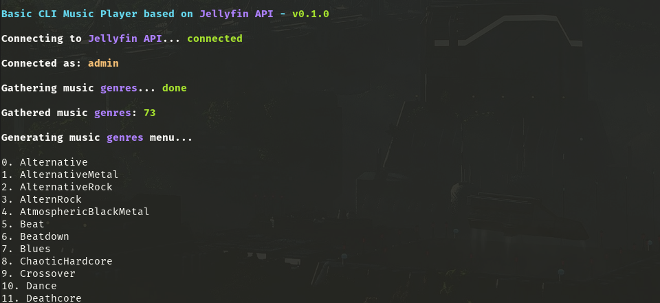
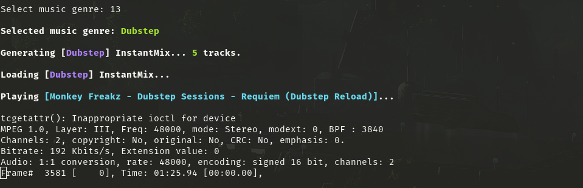

# Jellystream

A simple script that gives you the possibility to listen your music from your terminal within your Jellyfin server API.

## Dependencies

The script has some dependencies that needs to be installed before trying to run it:

```
sudo apt install curl jq mpg321
```

## How to use it

The script is quite easy to use, you basically just need to do the following before running it:

1. Create an API key on your Jellyfin server
2. Put your new API key and your server address in the script or in the config file
3. Save and run it

If the API key is correctly defined, you should see a text menu where you'll be asked to enter the number in front of the music genre. It will then automatically create an __IntantMix__ (_a feature from Jellyfin_) for the selected music genre which is apparently limited to __200__ songs.

That __InstantMix__ stream will be then passed to `mpg123` (or `mpg321`) that will read it and play the songs.

To skip tracks or play the next one, just hit `[Ctrl + C]` once.

### Config file

Here is the config file structure:

> The script will look for a file called `jellystream.conf` and load it if exists.

```conf
SERVER_ADDR="YOUR-SERVER-ADDRESS-WITH-PORT-IF-ANY"
API_KEY="YOUR-API-KEY"
```

__The `SERVER_ADDR` variable must contain the protocol and port.__

Here is an example of valid server addresses:

* `http://a.b.c.d:1234`
* `https://a.b.c.d:1234`
* `http://my-jellyfin-server.tld:1234`
* `https://my-jellyfin-server.tld:1234`
* `https://my-secret-jellyfin-tunnel.tld`

## Screenshot




## Todolist

* [X] Display songs metadata
* [ ] Improve metadata display
* [ ] Improve navigation between tracks
* [ ] Find a better way to kill the player
* [ ] Find a better way to pass the generated stream to __Icecast__ or similar

## Known issues

### Can't stop the player

When the stream has been loaded to `mpg123` via the _stdin_ buffer, it can't be killed as usual while hiting `[Ctrl + C]` twice fast ~~so the only solution I've found so far was to simply close the terminal session and it will stop everything.~~ so I've added a `kill` feature in the script.

You can stop the music play by using the `kill` feature that way:

```console
$ ./jellystream.sh kill
```

You should get something similar:

```console
$ ./jellystream.sh kill

Basic CLI Music Player based on JellyFin API - v0.1.0

Killing music player...

Done.
```

## Author

* __Jiab77__