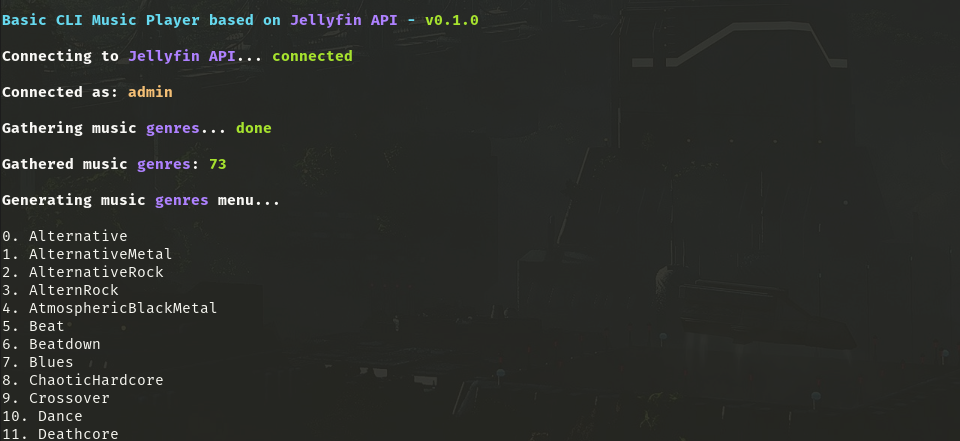
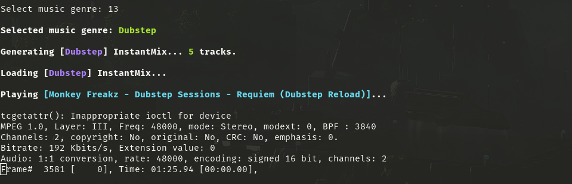

# Jellystream <!-- omit from toc -->

A simple script that gives you the possibility to listen your music from your terminal within your Jellyfin server API.

## Current version <!-- omit from toc -->

The latest version is __`0.2.0`__.

## Content <!-- omit from toc -->

* [Dependencies](#dependencies)
  * [Music players](#music-players)
* [How to use it](#how-to-use-it)
  * [Config file](#config-file)
* [Screenshots](#screenshots)
* [Todolist](#todolist)
* [Known issues](#known-issues)
* [Extra](#extra)
* [Author](#author)

---

## Dependencies

The script has some dependencies that needs to be installed before trying to run it:

```
sudo apt install curl jq
```

### Music players

Here is a list of currently supported music players:

* `mpg123`
* `mpv`

However, `mpv` remains the recommanded player as it provides extra functionalities like __desktop notifications__ which offer the possibility to control the player from a notification.

> Support for `gst123` will be added soon but already exist in the [random music player](#extra).

## How to use it

The script is quite easy to use, you basically just need to do the following before running it:

1. Create an API key on your Jellyfin server
2. Put your new API key and your server address in the script or in the config file
3. Save and run it

If the API key is correctly defined, you should see a text menu where you'll be asked to enter the number in front of the music genre. It will then automatically create an __IntantMix__ (_a feature from Jellyfin_) for the selected music genre which is apparently limited to __200__ songs.

That __InstantMix__ stream will be then passed to `mpg123` (or `mpg321`) that will read it and play the songs.

To skip tracks or play the next one, just hit `[Ctrl + C]` once.

### Config file

Here is the config file structure:

> The script will look for a file called `jellystream.conf` and load it if exists.

```conf
SERVER_ADDR="YOUR-SERVER-ADDRESS-WITH-PORT-IF-ANY"
API_KEY="YOUR-API-KEY"
```

__The `SERVER_ADDR` variable must contain the protocol and port.__

Here is an example of valid server addresses:

* `http://a.b.c.d:1234`
* `https://a.b.c.d:1234`
* `http://my-jellyfin-server.tld:1234`
* `https://my-jellyfin-server.tld:1234`
* `https://my-secret-jellyfin-tunnel.tld`

## Screenshots




> Screenshots needs to be updated.

## Todolist

* [X] Display songs metadata
* [X] Improve metadata display
* [X] Improve navigation between tracks
* [ ] Improve authentication method by using `AuthenticateByName` API endpoint
* [ ] Find a way to pass the generated stream to __Icecast__ or similar
* [X] Find a better way to kill the player

## Known issues

Nothing for the moment.

## Extra

I've kinda reused the same code / concept to create a random music player that can be run from CLI:

* [Random Music Player](rmp.sh) - (RMP)

It will look for the default music folder (`XDG_MUSIC_DIR`) and generate a dynamic list of existing audio files in memory and pass it to one of the supported music players.

## Author

* __Jiab77__